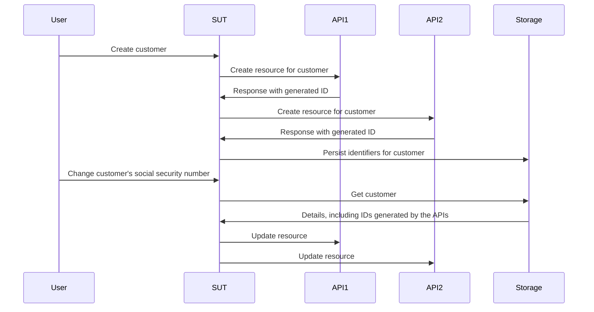

# Werken zonder mocks, stubs en observatoren

Dit hoofdstuk duikt in de wereld van testdoubles en onderzoekt hoe ze het test- en ontwikkelingsproces beïnvloeden. We leggen de beperkingen van traditionele mocks, stubs en Spies bloot en introduceren een efficiëntere en flexibelere aanpak met behulp van fakes en contracten.

## tl;dr

- Mocks, Spies en stubs moedigen je aan om ad-hoc aannames over het gedrag van je afhankelijkheden in elke test te coderen.
- Deze aannames worden meestal niet gevalideerd buiten handmatige controle, waardoor ze de bruikbaarheid van je testsuite bedreigen.
- Fakes en contracten bieden ons een duurzamere methode voor het maken van testdoubles met gevalideerde aannames en beter hergebruik dan de alternatieven.

Dit is een langer hoofdstuk dan normaal, dus om het palet op te schonen, is het raadzaam om eerst een [voorbeeldrepository](https://github.com/quii/go-fakes-and-contracts) te verkennen. Bekijk in het bijzonder de [plannertest](https://github.com/quii/go-fakes-and-contracts/blob/main/domain/planner/planner_test.go).

---

In [Mocking](https://bobkosse.gitbook.io/leer-go-met-tests/basisbeginselen-go/mocking) hebben we geleerd hoe mocks, stubs en Spies nuttige tools zijn voor het controleren en inspecteren van het gedrag van code-eenheden in combinatie met [Dependency Injection](https://bobkosse.gitbook.io/leer-go-met-tests/basisbeginselen-go/dependency-injection).

Naarmate een project groeit, *kunnen* dit soort testdoubles echter een onderhoudslast worden, en zouden we in plaats daarvan naar andere ontwerpideeën moeten kijken om ons systeem eenvoudig te kunnen begrijpen en testen.

**Fakes** en **contracten** stellen ontwikkelaars in staat hun systemen te testen met realistischere scenario's, de lokale ontwikkelervaring te verbeteren met snellere en nauwkeurigere feedbackloops en de complexiteit van evoluerende afhankelijkheden te beheren.

### Een inleiding tot testdoubles

Het is makkelijk om met je ogen te rollen als mensen zoals ik zo precies zijn over de terminologie van testdoubles, maar de verschillende soorten testdoubles helpen ons om dit onderwerp en de afwegingen die we maken helder te bespreken.

**Testdoubles** is de verzamelnaam voor de verschillende manieren waarop je afhankelijkheden kunt construeren die je kunt beheren voor een **onderwerp dat wordt getest** **(Subject Under Test(SUT))**, het object dat je test. Testdoubles zijn vaak een beter alternatief dan het gebruik van de echte afhankelijkheid, omdat het problemen kan vermijden zoals:

- Internet nodig hebben om een API te gebruiken
- Latency en andere prestatieproblemen vermijden
- Niet in staat zijn om non-happy path cases uit te voeren
- Jouw build loskoppelen van die van een ander team
- Je wilt geen implementaties voorkomen als een engineer in een ander team per ongeluk een bug heeft verzonden

In Go modelleer je meestal een afhankelijkheid met een interface en implementeer je vervolgens je eigen versie om het gedrag in een test te beheren. **Dit zijn de soorten testdubbels die in dit hoofdstuk worden behandeld**.

Gegeven deze interface van een hypothetische recepten-API:

```go
type RecipeBook interface {
	GetRecipes() ([]Recipe, error)
	AddRecipes(...Recipe) error
}
```

We kunnen testdubbels op verschillende manieren construeren, afhankelijk van hoe we iets proberen te testen dat een `Receptenboek` gebruikt.

**Stubs** retourneren telkens dezelfde standaardgegevens wanneer ze worden aangeroepen.

```go
type StubRecipeStore struct {
	recipes []Recipe
	err     error
}

func (s *StubRecipeStore) GetRecipes() ([]Recipe, error) {
	return s.recipes, s.err
}

// AddRecipes omitted for brevity
```

```go
// in test, we can set up the stub to always return specific recipes, or an error
stubStore := &StubRecipeStore{
	recipes: someRecipes,
}
```

**Observatoren** zijn vergelijkbaar met stubs, maar registreren ook hoe ze zijn aangeroepen. Zo kan de test bevestigen dat de SUT de afhankelijkheden op specifieke manieren aanroept.

```go
type SpyRecipeStore struct {
	AddCalls [][]Recipe
	err      error
}

func (s *SpyRecipeStore) AddRecipes(r ...Recipe) error {
	s.AddCalls = append(s.AddCalls, r)
	return s.err
}

// GetRecipes omitted for brevity
```

```go
// in test
spyStore := &SpyRecipeStore{}
sut := NewThing(spyStore)
sut.DoStuff()

// now we can check the store had the right recipes added by inspectiong spyStore.AddCalls
```

**Mocks** zijn een soort superset van de bovenstaande, maar ze reageren alleen met specifieke gegevens op specifieke aanroepen. Als de SUT de afhankelijkheden met de verkeerde argumenten aanroept, geeft de code vaak een `panic`.

```go
// set up the mock with expected calls
mockStore := &MockRecipeStore{}
mockStore.WhenCalledWith(someRecipes).Return(someError)

// when the sut uses the dependency, if it doesn't call it with someRecipes, usually mocks will panic
```

**Fakes** lijken op een echte versie van de afhankelijkheid, maar zijn geïmplementeerd op een manier die geschikter is voor snel draaiende, betrouwbare tests en lokale ontwikkeling. Vaak heeft je systeem een abstractie rond dataopslag, die wordt geïmplementeerd met een database, maar in je tests kun je in plaats daarvan een in-memory fake gebruiken.

```go
type FakeRecipeStore struct {
	recipes []Recipe
}

func (f *FakeRecipeStore) GetRecipes() ([]Recipe, error) {
	return f.recipes, nil
}

func (f *FakeRecipeStore) AddRecipes(r ...Recipe) error {
	f.recipes = append(f.recipes, r...)
	return nil
}
```

Fakes zijn nuttig omdat:

- Hun statefulness nuttig is voor tests met meerdere onderwerpen en aanroepen, zoals een integratietest. Het beheren van de status met andere soorten testdoubles wordt over het algemeen afgeraden.
- Als ze een verstandige API hebben, bieden ze een meer natuurlijke manier om de status te bepalen. In plaats van specifieke aanroepen van een afhankelijkheid te observeren, kun je de uiteindelijke status ervan opvragen om te zien of het gewenste effect daadwerkelijk is bereikt.
- Je kunt ze gebruiken om je applicatie lokaal uit te voeren zonder dat deze hoeft te worden opgestart of afhankelijk is van echte afhankelijkheden. Dit verbetert meestal de ontwikkelaarservaring (DX), omdat de fakes sneller en betrouwbaarder zijn dan hun echte tegenhangers.

Observatoren, Mocks en Stubs kunnen meestal automatisch worden gegenereerd vanuit een interface met behulp van een tool of reflectie. Omdat Fakes echter het gedrag coderen van de afhankelijkheid waarvoor u een double wilt maken, moet u in ieder geval het grootste deel van de implementatie zelf schrijven.

## Het probleem met stubs en mocks

In [Anti-patterns,](https://bobkosse.gitbook.io/leer-go-met-tests/meta/anti-patterns) staat beschreven hoe je voorzichtig moet zijn met het gebruik van test doubles. Het creëren van een rommelige testsuite is makkelijk als je ze niet weldoordacht gebruikt. Naarmate een project groeit, kunnen er echter andere problemen ontstaan.

Wanneer je gedrag codeert in test doubles, voeg je je aannames over hoe de werkelijke afhankelijkheid werkt toe aan de test. Als er een discrepantie is tussen het gedrag van de double en de werkelijke afhankelijkheid, of als er een discrepantie ontstaat in de loop van de tijd (bijvoorbeeld als de werkelijke afhankelijkheid verandert, wat *te verwachten* is), **kun je geslaagde tests hebben, maar mislukte software**.

Vooral stubs, spies en mocks vormen andere uitdagingen, vooral naarmate een project groeit. Om dit te illustreren, beschrijf ik een project waaraan ik heb gewerkt.

### Voorbeeld casestudy

*Sommige details zijn gewijzigd ten opzichte van wat er werkelijk gebeurde en het is sterk vereenvoudigd om het kort te houden. **Elke gelijkenis met bestaande personen, levend of overleden, berust op puur toeval.***

Ik werkte aan een systeem dat **zes** verschillende API's moest aanroepen, geschreven en onderhouden door andere teams wereldwijd. Ze waren _REST-achtig_ en de taak van ons systeem was om resources in al deze API's aan te maken en te beheren. Wanneer we alle API's voor elk systeem correct aanriepen, ontstond er _magie_ (bedrijfswaarde).

Onze applicatie was gestructureerd in een hexagonale / poorten & adapters-architectuur. Onze domeincode was losgekoppeld van de chaos van de buitenwereld waarmee we te maken hadden. Onze "adapters" waren in feite Go-clients die de aanroep van de verschillende API's inkapselden.


#### Problemen

Natuurlijk hebben we een testgedreven aanpak gehanteerd bij het bouwen van het systeem. We gebruikten stubs om de downstream API-reacties te simuleren en voerden een handvol acceptatietests uit om onszelf ervan te verzekeren dat alles zou moeten werken.

De API's die we grotendeels moesten aanroepen, waren echter:

- slecht gedocumenteerd
- beheerd door teams met veel andere conflicterende prioriteiten en druk, waardoor het niet makkelijk was om tijd voor ze vrij te maken
- vaak onvoldoende testdekking, waardoor ze op leuke en onverwachte manieren braken, terugvielen, enz.
- nog steeds in ontwikkeling (technisch en functioneel)

Dit leidde tot **veel onbetrouwbare tests** en veel hoofdpijn. Een _aanzienlijk_ deel van onze tijd besteedden we aan het pingen van veel drukke mensen op Slack om antwoorden te krijgen op de volgende vragen:

- Waarom is de API 'x' gaan doen?
- Waarom doet de API iets anders als wij 'y' doen?

Softwareontwikkeling is zelden zo eenvoudig als je zou hopen; het is een leerzame oefening. We moesten voortdurend leren hoe de externe API's werkten. Naarmate we leerden en ons aanpasten, moesten we onze testsuite updaten en uitbreiden, met name door **onze stubs aan te passen aan het daadwerkelijke gedrag van de API's.**

Het probleem was dat dit veel tijd in beslag nam en tot meer fouten leidde. Wanneer je kennis van een afhankelijkheid verandert, moet je de **juiste** test vinden om het gedrag van de stub te wijzigen, en er is een reëel risico dat je deze niet bijwerkt in andere stubs die dezelfde afhankelijkheid vertegenwoordigen.

#### Teststrategie

Bovendien, naarmate het systeem groeide en de eisen veranderden, realiseerden we ons dat onze teststrategie ongeschikt was. We hadden een handvol acceptatietests die ons het vertrouwen gaven dat het systeem als geheel werkte, en daarnaast een groot aantal unittests voor de verschillende pakketten die we schreven.

_We hadden iets ertussenin nodig_; we wilden vaak het gedrag van verschillende systeemonderdelen tegelijk aanpassen **maar niet het *hele* systeem opstarten voor een acceptatietest**. Unittests alleen gaven ons niet het vertrouwen dat de verschillende componenten als geheel werkten; ze konden het verhaal van wat we probeerden te bereiken niet vertellen (en verifiëren). **We wilden integratietests**.

#### Integratietests

Integratietests bewijzen dat twee of meer "units" correct werken wanneer ze worden gecombineerd (of geïntegreerd!). Deze units kunnen de code zijn die je schrijft of de geïntegreerde code met de code van iemand anders, zoals een database.

Naarmate een project groeit, wil je meer integratietests schrijven om te bewijzen dat grote delen van het systeem "samenhangen" - of integreren!

Je kunt in de verleiding komen om meer black-box acceptatietests te schrijven, maar deze worden al snel kostbaar vanwege de bouwtijd en onderhoudskosten. Het kan te duur zijn om een heel systeem op te starten als je slechts een *subset* van het systeem (en niet slechts één unit) wilt controleren op het juiste gedrag. Het schrijven van dure black-box tests voor elk stukje functionaliteit dat je uitvoert, is niet haalbaar voor grotere systemen.

#### Maak kennis met: Fakes

Het probleem was dat de manier waarop onze units werden getest, afhankelijk was van stubs, die grotendeels *stateless* zijn. We wilden tests schrijven die meerdere, *stateful* API-aanroepen bestrijken, waarbij we in het begin een resource kunnen aanmaken en deze later kunnen bewerken.

Hieronder volgt een verkorte versie van een test die we willen uitvoeren.

De SUT is een "servicelaag" die "use case"-verzoeken afhandelt. We willen bewijzen dat als een klant is aangemaakt, we de resources die we in de betreffende API's hebben aangemaakt, succesvol bijwerken wanneer hun gegevens veranderen.

Hieronder staan de vereisten die aan het team zijn meegegeven als een _user story_.

> ***Gegeven*** dat een gebruiker is geregistreerd met API 1, 2 en 3
>
> ***Wanneer*** het burgerservicenummer van de klant wordt gewijzigd
>
> ***Dan**, wordt de wijziging doorgevoerd in API's 1, 2 en 3



Tests die meerdere units bestrijken, zijn meestal niet compatibel met stubs **omdat ze niet geschikt zijn voor het bijhouden van de status**. We _zouden_ een black-box-acceptatietest kunnen schrijven, maar de kosten van deze tests zouden snel uit de hand lopen.

Bovendien is het ingewikkeld om grensgevallen te testen met een black-box-test, omdat je de afhankelijkheden niet kunt controleren. We wilden bijvoorbeeld bewijzen dat een rollback-mechanisme zou worden geactiveerd als één API-aanroep mislukte.

We moesten **fakes** gebruiken. Door onze afhankelijkheden te modelleren als stateful API's met in-memory fakes, konden we integratietests schrijven met een veel bredere scope, **waardoor we konden testen of echte use cases werkten**, wederom *zonder* het hele systeem te hoeven opstarten, en in plaats daarvan bijna dezelfde snelheid hadden als unittests.


Met behulp van fakes **kunnen we beweringen doen op basis van de uiteindelijke status van de betreffende systemen in plaats van te vertrouwen op ingewikkeld spying**. We zouden elke fake vragen welke records deze voor de klant bevatte en bevestigen dat deze waren bijgewerkt. Dit voelt natuurlijker; als we ons systeem handmatig zouden controleren, zouden we die API's raadplegen om hun status te controleren, in plaats van onze aanvraaglogboeken te inspecteren om te zien of we bepaalde JSON-payloads hebben verzonden.

```go
// take our lego-bricks and assemble the system for the test
fakeAPI1 := fakes.NewAPI1()
fakeAPI2 := fakes.NewAPI2() // etc..
customerService := customer.NewService(fakeAPI1, fakeAPI2, etc...)

// create new customer
newCustomerRequest := NewCustomerReq{
	// ...
}
createdCustomer, err := customerService.New(newCustomerRequest)
assert.NoErr(t, err)

// we can verify all the details are as expected in the various fakes in a natural way, as if they're normal APIs
fakeAPI1Customer := fakeAPI1.Get(createdCustomer.FakeAPI1Details.ID)
assert.Equal(t, fakeAPI1Customer.SocialSecurityNumber, newCustomerRequest.SocialSecurityNumber)

// repeat for the other apis we care about

// update customer
updatedCustomerRequest := NewUpdateReq{SocialSecurityNumber: "123", InternalID: createdCustomer.InternalID}
assert.NoErr(t, customerService.Update(updatedCustomerRequest))

// again we can check the various fakes to see if the state ends up how we want it
updatedFakeAPICustomer := fakeAPI1.Get(createdCustomer.FakeAPI1Details.ID)
assert.Equal(t, updatedFakeAPICustomer.SocialSecurityNumber, updatedCustomerRequest.SocialSecurityNumber)
```

Dit is eenvoudiger te schrijven en te lezen dan het controleren van verschillende functieaanroepargumenten die via _spies_ zijn gemaakt.

Deze aanpak stelt ons in staat om tests te gebruiken die brede delen van ons systeem bestrijken, waardoor we **zinvollere** tests kunnen schrijven over de use cases die we tijdens de stand-up bespreken, terwijl ze toch uitzonderlijk snel worden uitgevoerd.

#### Fakes brengen meer voordelen van encapsulatie met zich mee

In het bovenstaande voorbeeld hielden de tests zich niet bezig met hoe de afhankelijkheden zich gedroegen, behalve met het verifiëren van hun eindstatus. We creëerden de nepversies van de afhankelijkheden en injecteerden deze in het deel van het systeem dat we testten.

Met mocks/stubs zouden we elke afhankelijkheid moeten instellen om bepaalde scenario's af te handelen, bepaalde gegevens te retourneren, enz. Dit brengt gedrags- en implementatiedetails in je tests, waardoor de voordelen van encapsulatie afnemen.

We modelleren afhankelijkheden achter interfaces, zodat we ons als klanten _niet druk hoeven te maken over hoe het werkt_, maar met een "mockist"-benadering _moeten we ons er **in elke test** wel druk om maken_.

#### De onderhoudskosten van nep-tests

Nep-tests zijn duurder dan andere testdubbels, tenminste wat betreft de geschreven code; ze moeten de status bevatten en het gedrag simuleren van wat ze ook maar nabootsen. Elke discrepantie in gedrag tussen je nep-test en de echte test brengt het risico met zich mee dat je tests niet overeenkomen met de werkelijkheid. Dit leidt tot een scenario waarin je wel geslaagde tests hebt, maar kapotte software.

Wanneer je integreert met een ander systeem, of het nu de API van een ander team of een database is, doe je aannames op basis van het gedrag ervan. Deze kunnen worden vastgelegd in API-documentatie, persoonlijke gesprekken, e-mails, Slack-threads, enz.

Zou het niet handig zijn als we onze aannames konden **codificeren** om ze te vergelijken met zowel ons nep- als het daadwerkelijke systeem om te controleren of onze kennis op een herhaalbare en gedocumenteerde manier klopt?

**Contracten** zijn hiervoor het middel. Ze hielpen ons de aannames die we over de systemen van het andere team hadden gedaan te beheren en expliciet te maken. Veel explicieter en nuttiger dan e-mailuitwisselingen of eindeloze Slack-threads!


Door een contract te hebben, kunnen we ervan uitgaan dat we een neppe en een echte afhankelijkheid door elkaar kunnen gebruiken. Dit is niet alleen handig voor het bouwen van tests, maar ook voor lokale ontwikkeling.

Hier is een voorbeeld van een contract voor een van de API's waarvan het systeem afhankelijk is.

```go
type API1Customer struct {
	Name string
	ID   string
}

type API1 interface {
	CreateCustomer(ctx context.Context, name string) (API1Customer, error)
	GetCustomer(ctx context.Context, id string) (API1Customer, error)
	UpdateCustomer(ctx context.Context, id string, name string) error
}

type API1Contract struct {
	NewAPI1 func() API1
}

func (c API1Contract) Test(t *testing.T) {
	t.Run("can create, get and update a customer", func(t *testing.T) {
		var (
			ctx  = context.Background()
			sut  = c.NewAPI1()
			name = "Bob"
		)

		customer, err := sut.CreateCustomer(ctx, name)
		expect.NoErr(t, err)

		got, err := sut.GetCustomer(ctx, customer.ID)
		expect.NoErr(t, err)
		expect.Equal(t, customer, got)

		newName := "Robert"
		expect.NoErr(t, sut.UpdateCustomer(ctx, customer.ID, newName))

		got, err = sut.GetCustomer(ctx, customer.ID)
		expect.NoErr(t, err)
		expect.Equal(t, newName, got.Name)
	})

	// example of strange behaviours we didn't expect
	t.Run("the system will not allow you to add 'Dave' as a customer", func(t *testing.T) {
		var (
			ctx  = context.Background()
			sut  = c.NewAPI1()
			name = "Dave"
		)

		_, err := sut.CreateCustomer(ctx, name)
		expect.Err(t, ErrDaveIsForbidden)
	})
}
```

Zoals besproken in [Scaling Acceptance Tests](https://bobkosse.gitbook.io/leer-go-met-tests/basisbeginselen-testen/scaling-acceptance-tests), wordt de test, door te testen tegen een interface in plaats van een concreet type:

- Losgekoppeld van implementatiedetails
- eenvoudiger in verschillende contexten te (her)gebruiken.

Wat zijn de vereisten voor een contract? Het stelt ons in staat om onze `fake` te verifiëren en te ontwikkelen _en_ deze te testen tegen de daadwerkelijke implementatie.

Om onze in-memory `fake` te creëren, kunnen we het contract in een test gebruiken.

```go
func TestInMemoryAPI1(t *testing.T) {
	API1Contract{NewAPI1: func() API1 {
		return inmemory.NewAPI1()
	}}.Test(t)
}
```

En hier is de `fake` code

```go
func NewAPI1() *API1 {
	return &API1{customers: make(map[string]planner.API1Customer)}
}

type API1 struct {
	i         int
	customers map[string]planner.API1Customer
}

func (a *API1) CreateCustomer(ctx context.Context, name string) (planner.API1Customer, error) {
	if name == "Dave" {
		return planner.API1Customer{}, ErrDaveIsForbidden
	}

	newCustomer := planner.API1Customer{
		Name: name,
		ID:   strconv.Itoa(a.i),
	}
	a.customers[newCustomer.ID] = newCustomer
	a.i++
	return newCustomer, nil
}

func (a *API1) GetCustomer(ctx context.Context, id string) (planner.API1Customer, error) {
	return a.customers[id], nil
}

func (a *API1) UpdateCustomer(ctx context.Context, id string, name string) error {
	customer := a.customers[id]
	customer.Name = name
	a.customers[id] = customer
	return nil
}
```

### Evoluerende Software

De meeste software wordt niet voor altijd in één release gebouwd en "af" gemaakt.

Het is een stapsgewijze leeroefening, die zich aanpast aan de eisen van de klant en andere externe veranderingen. In het voorbeeld evolueerden en veranderden de API's die we aanriepen ook; bovendien leerden we tijdens de ontwikkeling van _onze_ software meer over welk systeem we _echt_ nodig hadden. Aannames die we in onze contracten hadden gedaan, bleken onjuist of _werden_ onjuist.

Gelukkig hadden we, zodra de contracten waren opgezet, een eenvoudige manier om met veranderingen om te gaan. Zodra we iets nieuws leerden, doordat een bug was opgelost of een collega ons informeerde dat de API aan het veranderen was, deden we het volgende:

1. Schrijf een test om het nieuwe scenario te oefenen. Een onderdeel hiervan is het aanpassen van het contract om je ertoe aan te zetten het gedrag in de nepversie te **simuleren**.
2. Het uitvoeren van de test zou moeten mislukken, maar voer eerst het contract uit tegen de echte afhankelijkheid om ervoor te zorgen dat de wijziging in het contract geldig is.
3. Werk de fake-versie bij zodat deze voldoet aan het contract.
4. Laat de test slagen.
5. Refactor.
6. Voer alle tests uit en verzend.

Het uitvoeren van de volledige testsuite vóór het inchecken kan ertoe leiden dat andere tests mislukken omdat de fake-versie zich anders gedraagt. Dit is een **goede zaak**! Je kunt nu alle andere onderdelen van het systeem repareren, afhankelijk van het gewijzigde systeem; je kunt er zeker van zijn dat ze dit scenario ook in productie zullen afhandelen. Zonder deze aanpak zou je *eraan moeten denken* om alle relevante tests te vinden en de stubs bij te werken. Foutgevoelig, arbeidsintensief en saai.

### Superieure ontwikkelaarservaring

Het hebben van een suite met fakes en bijbehorende contracten voelde als een superkracht. We konden eindelijk de complexiteit van de API's waarmee we te maken hadden, temmen.

Het schrijven van tests voor verschillende scenario's werd veel eenvoudiger. We hoefden niet langer voor elke test een reeks stubs en spies te assembleren; we konden onze set units of modules (de fakes, onze eigen "services") heel eenvoudig assembleren om de verschillende vreemde en wonderlijke scenario's die we nodig hadden te oefenen.

Elke test met een stub, spie of mock moet _zorgen_ voor hoe het externe systeem zich gedraagt, dankzij de ad-hoc-opstelling. Aan de andere kant kunnen fakes worden behandeld als elke andere goed ingekapselde code-eenheid, waarbij de details voor je verborgen blijven en je ze gewoon kunt gebruiken.

We konden een zeer realistische versie van het systeem lokaal draaien, en omdat het allemaal in het geheugen stond, startte en draaide het extreem snel. Dit betekende dat onze testtijden extreem laag waren, wat erg indrukwekkend was, gezien hoe uitgebreid de suite was.

Als onze acceptatietests in onze testomgeving mislukten, was onze eerste stap het uitvoeren van onze contracten op de API's waarvan we afhankelijk waren. Vaak ontdekten we problemen **vóórdat de ontwikkelaars van de andere systemen dat deden**.

### Van het happy path af met decorators

Voor foutscenario's zijn stubs handiger omdat je direct toegang hebt tot *hoe* ze zich gedragen in de test, terwijl fakes vaak vrij black-box zijn. Dit is een bewuste ontwerpkeuze, omdat we willen dat de gebruikers ervan (bijv. tests) zich geen zorgen hoeven te maken over hoe ze werken; ze moeten erop kunnen vertrouwen dat ze het juiste doen dankzij de ondersteuning van het contract.

Hoe zorgen we ervoor dat de fakes mislukken, zodat we non-happy path zorgen kunnen oefenen?

Er zijn talloze scenario's waarin je als ontwikkelaar het gedrag van code moet aanpassen zonder de broncode te wijzigen. Het **decoratorpatroon** is vaak een manier om een code-eenheid te nemen en zaken toe te voegen zoals logging, telemetrie, retries en meer. We kunnen het gebruiken om onze fakes te verpakken om gedragingen indien nodig te overschrijven.

Terugkerend naar het `API1`-voorbeeld: we kunnen een type maken dat de benodigde interface implementeert en de fake omhult.

```go
type API1Decorator struct {
	delegate           API1
	CreateCustomerFunc func(ctx context.Context, name string) (API1Customer, error)
	GetCustomerFunc    func(ctx context.Context, id string) (API1Customer, error)
	UpdateCustomerFunc func(ctx context.Context, id string, name string) error
}

// assert API1Decorator implements API1
var _ API1 = &API1Decorator{}

func NewAPI1Decorator(delegate API1) *API1Decorator {
	return &API1Decorator{delegate: delegate}
}

func (a *API1Decorator) CreateCustomer(ctx context.Context, name string) (API1Customer, error) {
	if a.CreateCustomerFunc != nil {
		return a.CreateCustomerFunc(ctx, name)
	}
	return a.delegate.CreateCustomer(ctx, name)
}

func (a *API1Decorator) GetCustomer(ctx context.Context, id string) (API1Customer, error) {
	if a.GetCustomerFunc != nil {
		return a.GetCustomerFunc(ctx, id)
	}
	return a.delegate.GetCustomer(ctx, id)
}

func (a *API1Decorator) UpdateCustomer(ctx context.Context, id string, name string) error {
	if a.UpdateCustomerFunc != nil {
		return a.UpdateCustomerFunc(ctx, id, name)
	}
	return a.delegate.UpdateCustomer(ctx, id, name)
}
```

In onze tests kunnen we vervolgens het veld `XXXFunc` gebruiken om het gedrag van de test-double te wijzigen, net zoals je dat met stubs, spies of mocks zou doen.

```go
failingAPI1 = NewAPI1Decorator(inmemory.NewAPI1())
failingAPI1.UpdateCustomerFunc = func(ctx context.Context, id string, name string) error {
	return errors.New("failed to update customer")
}
```

Dit is echter _onhandig_ en vereist een zekere mate van beoordelingsvermogen. Met deze aanpak verlies je de garanties uit je contract, omdat je ad-hocgedrag introduceert in je fake-tests.

Het is verstandig om de context te onderzoeken; je zou kunnen concluderen dat het eenvoudiger is om specifieke, un-happy paden op unit testniveau te testen met behulp van een stub.

### Is dit geen extra codeverspilling?

Het is wishful thinking om te geloven dat we alleen code moeten schrijven die klanten bedient en een systeem verwachten waarop we efficiënt kunnen bouwen. Mensen hebben een zeer verdraaide mening over wat verspilling is (zie mijn bericht: [The ghost of Henry Ford is ruining your development team](https://quii.dev/The_ghost_of_Henry_Ford_is_ruining_your_development_team)).

Geautomatiseerde tests leveren klanten geen direct voordeel op, maar we schrijven ze om onszelf efficiënter te maken in ons werk (je schrijft toch geen tests om dekkingsscores te behalen?).

Engineers moeten scenario's eenvoudig kunnen simuleren (op een herhaalbare manier, niet ad-hoc) om te debuggen, testen en problemen op te lossen. **In-memory fakes en een goed modulair ontwerp stellen ons in staat om de relevante actoren voor een scenario te isoleren en extreem goedkoop snelle, geschikte tests te schrijven**. Deze flexibiliteit stelt ontwikkelaars in staat om iteraties uit te voeren op een systeem dat veel beter beheersbaar is dan een wirwar van tests, die worden getest met dure schrijf- en uitvoeringsblackboxtests of, erger nog, handmatige tests in een gedeelde omgeving.

Dit is een voorbeeld van [simpel versus makkelijk](https://www.youtube.com/watch?v=SxdOUGdseq4). Natuurlijk zullen fakes en contracten op de korte termijn leiden tot meer geschreven code dan stubs en spies, maar het resultaat is een eenvoudiger en goedkoper te onderhouden systeem op de lange termijn. Het stukje bij beetje updaten van spies, stubs en mocks is arbeidsintensief en foutgevoelig, omdat je geen bijbehorende contracten hebt om te controleren of je testdubbels correct functioneren.

Deze aanpak brengt _iets_ hogere initiële kosten met zich mee, maar met veel lagere kosten zodra de contracten en fakes zijn opgezet. Fakes zijn herbruikbaarder en betrouwbaarder dan ad-hoc testdubbels zoals stubs.

Het voelt *erg* bevrijdend en geeft je **vertrouwen** wanneer je een bestaande, in de praktijk geteste fake-test gebruikt, in plaats van een stub op te zetten bij het schrijven van een nieuwe test.

### Hoe past dit in TDD?

Ik zou niet aanraden om met een contract te _beginnen_; dat is bottom-up design, waar je over het algemeen slimmer mee om moet gaan, en het gevaar bestaat dat je te veel nadenkt over hypothetische vereisten.

Deze techniek is compatibel met de "acceptatietest-gedreven aanpak" zoals besproken in eerdere hoofdstukken, [The Why of TDD](https://quii.dev/The_Why_of_TDD) en in [GOOS](http://www.growing-object-oriented-software.com)

- Schrijf een falende [acceptatietest](https://bobkosse.gitbook.io/leer-go-met-tests/basisbeginselen-testen/scaling-acceptance-tests).
- Stuur voldoende code uit om de test te laten slagen, wat meestal resulteert in een "servicelaag" die afhankelijk is van een API, een database of iets dergelijks. Meestal heb je businesslogica die losgekoppeld is van externe factoren (zoals persistentie, het aanroepen van een database, enz.) via een interface.
- Implementeer de interface eerst met een in-memory fake om alle tests lokaal te laten slagen en het initiële ontwerp te valideren.
- Om naar productie te pushen, kun je geen in-memory gebruiken! Codeer de aannames die je hebt gemaakt ten opzichte van de fake in een contract.
- Gebruik het contract om de daadwerkelijke afhankelijkheid te creëren, zoals een MySQL-versie van een opslag.
- Verscheep naar productie.

## Waar is het hoofdstuk over het testen van databases?

Dit is een veelgehoorde vraag die ik al meer dan vijf jaar uitstel. De reden is dat dit hoofdstuk altijd mijn antwoord zal zijn.

_Maak de databasedriver niet belachelijk en spy geen oproepen_. Deze tests zijn moeilijk te schrijven en hebben mogelijk weinig waarde. Je moet niet beweren of een specifieke `SQL`-instructie naar de database is verzonden, dat wil zeggen implementatiedetails; **je tests zouden alleen op gedrag moeten letten**. Het bewijzen dat een specifieke SQL-instructie is gecompileerd, bewijst _niet_ dat je code _zich gedraagt_ zoals je wilt.

**Contracten** dwingen je om je tests los te koppelen van implementatiedetails en je te concentreren op gedrag.

Volg de hierboven beschreven TDD-aanpak om je persistentiebehoeften te versoepelen.

[De voorbeeldrepository](https://github.com/quii/go-fakes-and-contracts) bevat enkele voorbeelden van contracten en laat zien hoe deze worden gebruikt om in-memory- en SQLite-implementaties van bepaalde persistentiebehoeften te testen.

```go
package inmemory_test

import (
	"github.com/quii/go-fakes-and-contracts/adapters/driven/persistence/inmemory"
	"github.com/quii/go-fakes-and-contracts/domain/planner"
	"testing"
)

func TestInMemoryPantry(t *testing.T) {
	planner.PantryContract{
		NewPantry: func() planner.Pantry {
			return inmemory.NewPantry()
		},
	}.Test(t)
}
```

```go
package sqlite_test

import (
	"github.com/quii/go-fakes-and-contracts/adapters/driven/persistence/sqlite"
	"github.com/quii/go-fakes-and-contracts/domain/planner"
	"testing"
)

func TestSQLitePantry(t *testing.T) {
	client := sqlite.NewSQLiteClient()
	t.Cleanup(func() {
		if err := client.Close(); err != nil {
			t.Error(err)
		}
	})

	planner.PantryContract{
		NewPantry: func() planner.Pantry {
			return sqlite.NewPantry(client)
		},
	}.Test(t)
}
```

Hoewel Docker et al. het lokaal draaien van databases _wel_ eenvoudiger maken, kunnen ze nog steeds een aanzienlijke prestatieoverhead met zich meebrengen. Fakes met contracten stellen je in staat om de noodzaak om de "zwaardere" afhankelijkheid te gebruiken te beperken tot alleen wanneer je het contract valideert, en niet voor andere soorten tests.

Het gebruik van in-memory fakes voor acceptatie- en integratietests voor *de rest* van het systeem biedt een veel snellere en eenvoudigere ontwikkelervaring.

## Samenvattend

Het komt vaak voor dat softwareprojecten worden georganiseerd met verschillende teams die tegelijkertijd systemen bouwen om een gemeenschappelijk doel te bereiken.

Deze werkwijze vereist een hoge mate van samenwerking en communicatie. Velen denken dat we met een "API first"-aanpak een aantal API-contracten kunnen definiëren (vaak op een wikipagina!) en vervolgens zes maanden zelfstandig kunnen werken om alles aan elkaar te plakken. Dit werkt in de praktijk zelden goed, omdat we, zodra we beginnen met het schrijven van code, het domein en het probleem beter begrijpen, wat onze aannames op de proef stelt. We moeten reageren op deze veranderingen in kennis, die vaak teamoverstijgende veranderingen vereisen.

Dus, als je je in deze situatie bevindt, moet je je systeem optimaal structureren en testen om te kunnen omgaan met onvoorspelbare veranderingen, zowel binnen als buiten het systeem waaraan je werkt.

> "Een van de bepalende kenmerken van goed presterende teams in softwareontwikkeling is hun vermogen om vooruitgang te boeken en van gedachten te veranderen, zonder toestemming te vragen aan iemand of groep buiten hun kleine team."
>
> Moderne software engineering
> David Farley

Vertrouw niet op wekelijkse vergaderingen of Slack-discussies om wijzigingen uit te werken. **Leg je aannames vast in contracten**. Vergelijk die contracten met de systemen in je build-pipelines, zodat je snel feedback krijgt als er nieuwe informatie aan het licht komt. Deze contracten, in combinatie met **fake-contracten**, zorgen ervoor dat je zelfstandig kunt werken en externe wijzigingen duurzaam kunt beheren.

### Je systeem als een verzameling modules

Verwijzend naar Farley's boek, beschrijf ik het idee van **incrementalisme**. Software bouwen is een *voortdurende leeroefening*. Het begrijpen van de vereisten waaraan een bepaald systeem moet voldoen om direct waarde te leveren, is onrealistisch. Daarom moeten we onze systemen en werkwijzen optimaliseren om **snel feedback te verzamelen en te experimenteren**.

Je hebt een **modulair systeem** nodig om te profiteren van de ideeën die in dit hoofdstuk worden besproken. Als je modulaire code hebt met betrouwbare fake-versies, kun je goedkoop met je systeem experimenteren via geautomatiseerde tests.

We vonden het extreem gemakkelijk om vreemde, hypothetische (maar mogelijke) scenario's te vertalen naar zelfstandige tests om ons te helpen het probleem te begrijpen en robuustere software te ontwikkelen door onze modules samen te stellen en verschillende gegevens in verschillende volgordes uit te proberen, waarbij sommige API's faalden, enz.

Goed gedefinieerde, goed geteste modules stellen je in staat om je systeem te incrementeren zonder veranderingen en om _alles_ in één keer te begrijpen.

### Maar ik werk aan iets kleins met stabiele API's

Zelfs met stabiele API's wil je niet dat je ontwikkelervaring, builds en dergelijke nauw verbonden zijn met de code van anderen. Wanneer je deze aanpak goed aanpakt, krijg je een samenstelbare set modules om je systeem samen te stellen voor productie, lokaal te draaien en verschillende soorten tests te schrijven met doubles die je vertrouwt.

Het stelt je in staat om de onderdelen van je systeem waar je je zorgen over maakt te isoleren en zinvolle tests te schrijven over het echte probleem dat je probeert op te lossen.

### Maak van je afhankelijkheden eersteklas burgers.

Natuurlijk hebben stubs en spies hun nut. Het ad-hoc simuleren van verschillend gedrag van je afhankelijkheden in tests zal altijd nuttig zijn, maar pas op dat de kosten niet uit de hand lopen.

Zo vaak in mijn carrière heb ik zorgvuldig geschreven software van getalenteerde ontwikkelaars zien mislukken door integratieproblemen. Integratie is een uitdaging voor engineers _omdat_ het moeilijk is om het exacte gedrag te reproduceren van een systeem dat is geschreven door andere engineers, die het ook tegelijkertijd wijzigen.

Sommige teams vertrouwen erop dat iedereen in een gedeelde omgeving implementeert en daar test. Het probleem is dat dit je geen **geïsoleerde** feedback geeft, en de **feedback is traag**. Je zult nog steeds niet in staat zijn om verschillende experimenten uit te voeren met hoe je systeem werkt met andere afhankelijkheden, althans niet efficiënt.

**We moeten deze complexiteit temmen door geavanceerdere manieren te gebruiken om onze afhankelijkheden te modelleren** om snel te kunnen testen/experimenteren op onze ontwikkelmachines voordat het in productie gaat. Creëer realistische en beheersbare fake-versies van je afhankelijkheden, geverifieerd door contracten. Vervolgens kun je zinvollere tests schrijven en experimenteren met je systeem, waardoor je kans op succes toeneemt.
